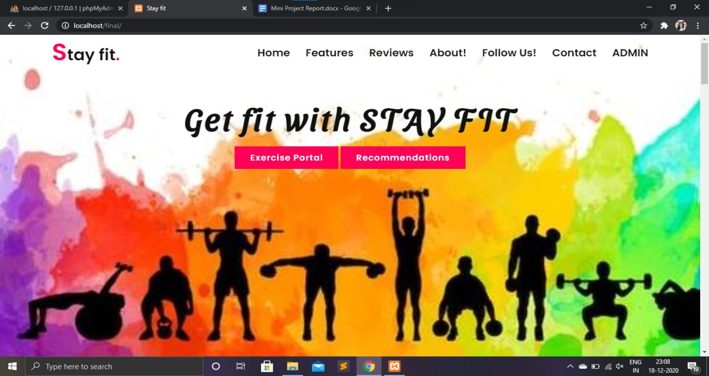

# Stay-fit--A-web-application-which-tracks-your-fitness

For other libraries, images and fonts:
https://drive.google.com/drive/folders/1dNrjiFNIlLqKI3O34zdZ6ePomBqtD21b?usp=sharing

For the execution instructions or the video:
https://drive.google.com/file/d/1rQDG85BbekKP3wrJftYu-1u9o000kDNZ/view?usp=sharing

Report & ppts: https://github.com/likhitaavl2k/Stay-fit--A-web-application-which-tracks-your-fitness/tree/main/Report%20%26%20PPT

<b>Few Screenshots:</b>

<b>Introduction:</b> 
StayFit is a web application for analyzing and logging strength training and body building data. StayFit has two different portals i.e exercise portal and recommendations portal. Apart from this, it also includes an admin portal.
Exercise portal aims to present workout data in a way that highlights and encourages progressive overload and long term commitment. There are many workout tracking apps already available, what sets this one apart is the focus on data. If you want a workout application that guides you through a routine this isn't the tool for you. Exercise portal hasno server and works completely offline using IndexedDB.
On the other hand, if you manage the routine yourself and track your workouts in a spreadsheet with a bunch of formulas and charts, you're probably the kind of person who would like this application. 
Recommendations portal provides 3 different subscription plans (Basic, Standard, Premium) where the user can choose their plan according to their requirement. These plans provide basic workout tutorials, workout recommendations and food recommendations according to the user’s weight.
These plans recommend a particular type of workout according to his/her weight and the same follows with food recommendations i.e., for Breakfast, Lunch and Dinner based on the calorie intake.

<b>Features:</b> 
   1. Simple workout data entry supporting reps, sets, weight, duration, warmup and failure sets
   2. Musculature visualizations
   3. Intensity and volume calculations
   4. Import from CSV
   5. Export to JSON
   6. Track and visualize personal records 
   7. Exercise search
   8. Punchcard graph
   9. Supports multiple workouts per day
  10. Proper time zone support (important for people who travel)
  11. Workouts portal works offline, no network connection required
  12. Lots of charts
  13. Provides different subscription plans for users (Basic, Standard, Premium), paid through payment gateway (PayPal).
  14. Basic plan provides workout tutorials 
  15. Standard plan provides workout recommendations including features of basic plan.
  16. Premium plan includes food recommendations including features of standard
  17. A chatbot for conducting an online chat conversation via text.
  18. Admin portal for providing recommendations on daily basis.
  19. Lightbox extension for larger view of pictures and gifs.
  20. Ngrok for temporarily hosting a webpage(https://ngrok.com/docs).
 
<b>3 modules:</b>
  1. Exercise portal
  2. Recommendation's portal
  3. Admin portal
  
<b>Software Requirements:</b> 
-> Frontend :- HTML,CSS,JS 
-> Backend :- PHP 
-> Styling :- Bootstrap 
-> Database :- MySql 

<b>Hardware Requirements:</b>
-> Operating System :- Windows/Mac/Linux 
-> Browser which supports javascript and Indexed DB (Browser Database)

<b>Step-wise instructions:</b>
  1. Download the zip file of this repository
  2. Unzip the folder 
  3. Place the folder into htdocs of xampp folder (C:\xampp\htdocs)
  4. Open database/admin.sql file 
  5. Import it to the wamp/xampp folder (Note: Username for phpmyadmin is ‘root’; password is ‘’)
  6. Opening file for the project is index.php
  7. Exercise portal and recommendations portal can be accessed from the same page.
  8. To login as admin, use initial credentials (Note: Username is admin, password is admin)
  9. Logout will directly redirect the user as well as admin to home page
  10. dbconfig.php contains the data for the connection of the localhost to the database of phpmyadmin. Login credentials for phpmyadmin can be restructured there as well.
  11. Paypal can be used only when our project is hosted. So to temporarily host a page, <b>ngrok</b>(https://ngrok.com/docs) can be used. 
  12. For detailed explanation, look at the execution video from the below link
  	https://drive.google.com/file/d/1rQDG85BbekKP3wrJftYu-1u9o000kDNZ/view?usp=sharing
